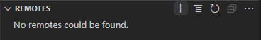
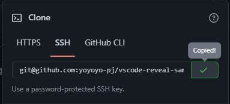

### VSCodeの拡張機能のGitLensがあまりに便利すぎるという話

---

### はじめに

- 以前の記事である[GitHubとVSCode、vscode-revealを使って、知識のストック→アウトプットをシームレスに行える環境を整えた話](https://qiita.com/yoyoyo_pg/items/413729f47854af2e644b)の続きです
- 前回の記事ではあまり触れていなかった`GitLens`についての使い方解説です

---

### 対象

- VSCode上でラクにGit操作をしたい方

---

### 前提

- Gitの基本的な使い方が分かること
- Git、VSCodeがインストール済であること

---

### VSCodeデフォルトの場合

- 基本的なGit操作はできる
  - 変更の追跡、差分確認、コミット、プッシュなど

---

### GitLensとは

- VSCode内でGitの各種操作をしやすくするための拡張機能
- リポジトリの状態、ブランチ管理を視覚的に行える

---

### GitLensを入れてみると

- 先ほどの「ソース管理」内に以下のビューが追加
- 今回はその中でもよく使うビューについて紹介します

---

#### COMMITS（コミットビュー）

現在のブランチのコミットが一覧表示されます  

--

また、過去のコミットの詳細も確認できます

---

#### FILE HISTORY（ファイル履歴ビュー）

現在開いているファイルの更新履歴を可視化してくれるビューです  
こちらも、コミットビューと同様にコミットの詳細を確認できます

---

#### BRANCHES（ブランチビュー）

すべてのローカルブランチが一覧表示されます
右側に「✓」がついているのが現在のブランチです
視覚的にブランチの状態が分かる点が便利です

--

**プルされていない変更がある場合**  
「↓」アイコンクリックでプルができます

**プッシュしていない変更がある場合**  
「↑」アイコンクリックでプッシュができます

--

**ブランチ作成**  
ブランチを選択し右クリック > Create Branchを選択  

上部メニューに新規ブランチ名を入力してEnterで、新しいブランチが作成できます

---

#### REMOTES（リモートビュー）

リモートの状態が一覧表示されます  
fetchやpruneがアイコンクリックでできます

.png)

リモートがない場合、以下のように表示されます

--

**新規リモートの作成**
「+」アイコンクリック後、リモート名、リポジトリURIを入力しEnter  
すると、リモートに追加されます

---

### まとめ

- 手軽にGit操作ができるので非常に便利です！
- 他にも便利な機能があれば是非教えてください！

---

### 参考文献

- [gitkraken/vscode-gitlens](https://github.com/gitkraken/vscode-gitlens#repositories-view-)
- [GitLens --- Git supercharged](https://gitlens.amod.io/)
