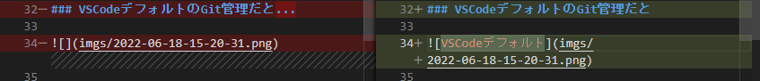

### VSCodeの拡張機能のGitLensがあまりに便利すぎるという話

---

### はじめに

- 以前の記事である[GitHubとVSCode、vscode-revealを使って、知識のストック→アウトプットをシームレスに行える環境を整えた話](https://qiita.com/yoyoyo_pg/items/413729f47854af2e644b)の続きです
- 前回の記事ではあまり触れていなかった`GitLens`についての使い方解説です

---

### 対象

- VSCode上でラクにGit操作をしたい方

---

### 前提

- Gitの基本的な使い方が分かること
- Git、VSCodeがインストール済であること

---

### VSCodeデフォルトの場合

- 基本的なGit操作はできる
- 変更の追跡、差分確認

---

### GitLensとは

- VSCode内でGitの各種操作をしやすくするための拡張機能です
- 公式サイトは[コチラ](https://github.com/gitkraken/vscode-gitlens)